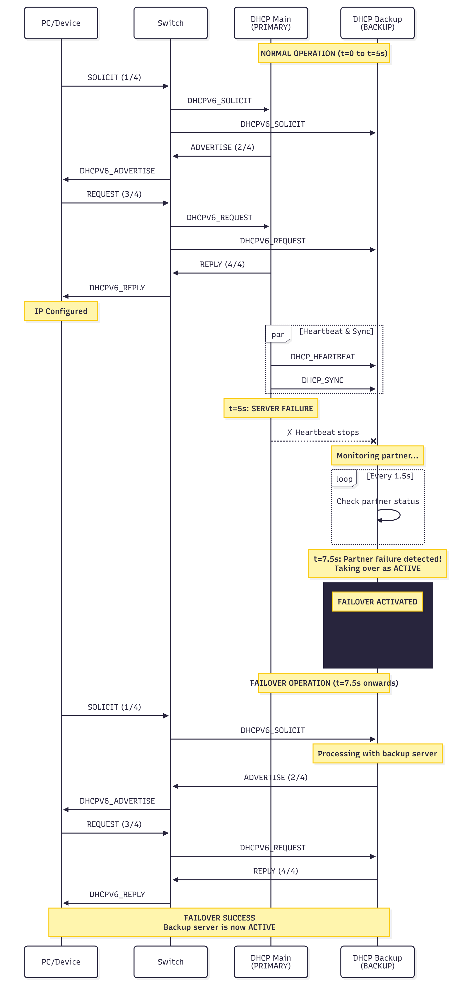
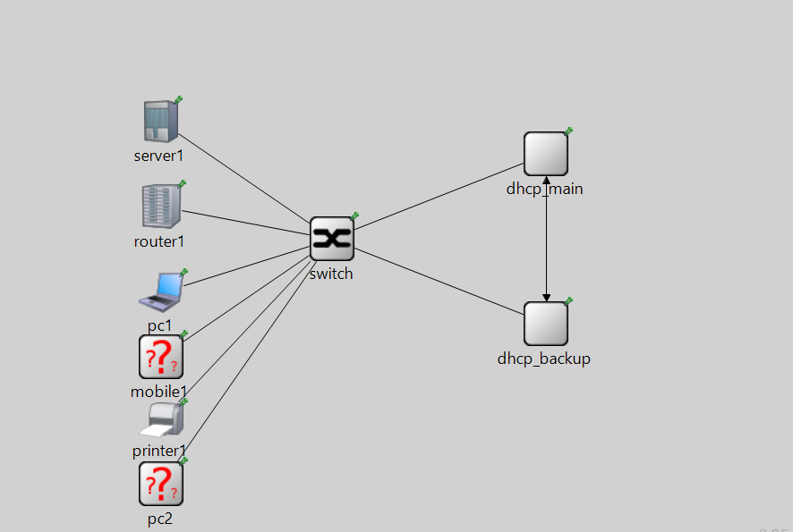

# 🌐 Priority-Based DHCPv6 Network Simulation

A comprehensive **network simulation** demonstrating **DHCPv6** with **priority-based service distribution** and an **active-passive failover mechanism** using **OMNeT++**.

---

## 📺 Demo Video

🎥 Watch the project demonstration:  
[Video Link](https://youtu.be/Yi4SssU8-G8)

---

## 📊 Sequence Diagram

Below is the sequence diagram showing the message flow between the DHCPv6 servers and clients:



> 🖼️ Replace the image path above with your actual file location.

---

## 🎯 Overview

This project simulates an advanced **Dynamic Host Configuration Protocol for IPv6 (DHCPv6)** system that includes:

- **Priority-based IP allocation:** Clients with higher priority levels are assigned preferred address ranges.
- **Failover mechanism:** Implements **active-passive redundancy** — if the primary DHCPv6 server fails, the secondary server automatically takes over.
- **Load balancing:** Ensures optimal address assignment and reduces IP conflict.
- **Network resilience testing:** Simulates different network failure scenarios.

---

## 🧠 Features

✅ Dynamic IP assignment based on client priority  
✅ Redundancy with automatic failover (Active–Passive)  
✅ Realistic packet exchange simulation in OMNeT++  
✅ Server synchronization with lease database replication  
✅ Support for multiple client types and priorities  

---

## 🧩 System Architecture



---

## ⚙️ Tools & Technologies

| Tool / Library      | Purpose                                      |
|---------------------|----------------------------------------------|
| **OMNeT++ 6.0+**    | Network simulation framework                 |
| **INET Framework**  | Provides DHCPv6 and IPv6 network models      |
| **C++ / NED**       | For network module logic                     |
| **XML Config**      | For DHCPv6 server and client configuration   |
| **GitHub**          | For version control and project hosting      |

---

## 🧪 Simulation Setup

### 1️⃣ Prerequisites
- Install **OMNeT++ 6.0 or later**
- Add **INET framework**
- Clone or copy this project into the `samples/` directory of OMNeT++

### 2️⃣ Run the Simulation
```bash
cd omnetpp-6.x/samples/prioritydhcp
make
opp_run -u Qtenv -n .:../inet/src -l ../inet/src/INET PriorityDHCPv6.ini
```

### 3️⃣ View Results
- Open Qtenv to visualize network topology.
- Observe packet flow, server failover, and priority-based IP assignment.

---

## 📂 Project Structure

```
prioritydhcp/
├── src/
│   ├── Modules/
│   │   ├── DHCPv6Server.ned
│   │   ├── DHCPv6Client.ned
│   │   └── PriorityLogic.cc
│   └── Config/
│       └── dhcpv6_config.xml
├── images/
│   └── sequence_diagram.png
├── PriorityDHCPv6.ini
├── omnetpp.ini
└── README.md
```

---

## 🔄 Failover Logic

- The **active server** manages IP assignments and maintains the lease database.
- The **passive server** continuously syncs with the active one.
- When the active server fails, the passive takes over seamlessly.
- When the active server comes back online, it re-synchronizes before resuming operation.

---

## 🚀 Future Enhancements

🔸 Add load balancing (active-active) DHCPv6 mode  
🔸 Integrate real-time monitoring dashboard  
🔸 Include IPv4 backward compatibility  
🔸 Extend to mobile network simulation  

---

## 📜 License

This project is licensed under the **MIT License**.  
See the [LICENSE](LICENSE) file for more details.

---

## 🧩 References

- [OMNeT++ Official Documentation](https://omnetpp.org)
- [INET Framework Reference](https://inet.omnetpp.org)
- [DHCPv6 RFC 8415](https://datatracker.ietf.org/doc/html/rfc8415)

---

